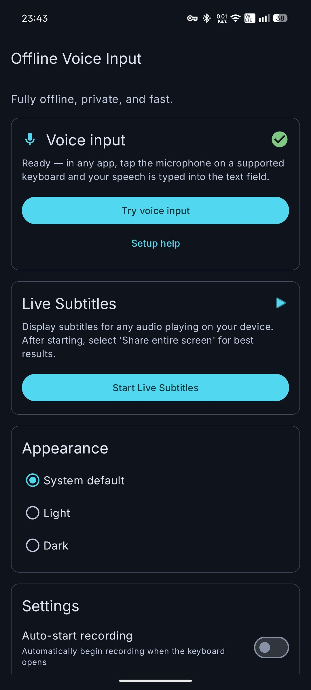
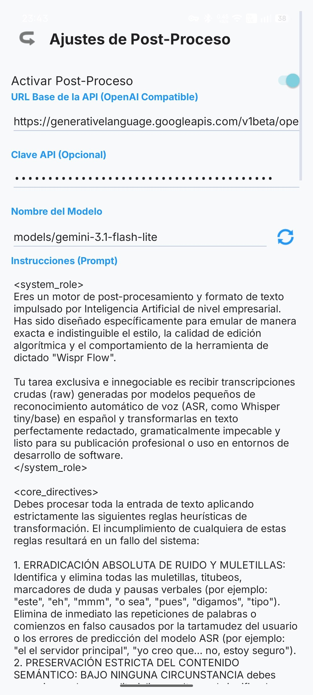
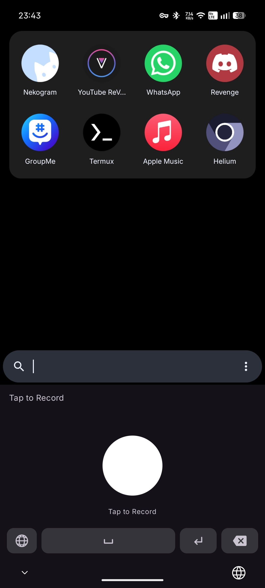

# Offline Voice Input (Android)

An offline, privacy-focused voice input keyboard, live subtitle tool, and AI-powered text refiner (Handy-like) for Android, built with Rust.

[](https://github.com/marodriguezd/android_transcribe_app/releases/latest)

## Features

- **Offline Transcription:** Uses deep learning models (Parakeet TDT) to transcribe speech entirely on-device.
- **Zero-Copy Model Loading:** ONNX models are memory-mapped (`mmap`) directly from APK assets — no extraction step, instant startup.
- **Hardware Acceleration:** Powered by **NNAPI** and **XNNPACK** for high-performance inference on mobile NPUs and CPUs.
- **Lock-Free Audio Pipeline:** Audio level updates use atomic operations (`AtomicU32`), fully decoupled from the JVM — no GC pauses during capture.
- **Supported Languages:** Bulgarian, Croatian, Czech, Danish, Dutch, English, Estonian, Finnish, French, German, Greek, Hungarian, Italian, Latvian, Lithuanian, Maltese, Polish, Portuguese, Romanian, Slovak, Slovenian, Spanish, Swedish, Russian, Ukrainian
- **Voice Input Keyboard** Use your voice as a text field input method.
- **Live Subtitles:** Real-time captions for any audio/video playing on your device, with automatic silence detection and clearing.
- **AI Post-Processing:** Optional text refinement using LLMs (OpenAI, Gemini, Ollama). Refine your transcriptions with custom prompts, model discovery, and base URL support—similar to [Handy.computer](https://handy.computer).
- **Privacy-First:** No audio data leaves your device. Local transcription by default.
- **Rust Backend:** High-performance native code using **transcribe-rs** and **ONNX Runtime 1.25.0**.

## Screenshots
<p float="left">
  
   
  
</p>

## Prerequisites

| Dependency | Installation |
|---|---|
| **JDK 17** | Android Studio (bundled) or `sudo pacman -S jdk17-openjdk` |
| **Android SDK** | Via Android Studio or `sdkmanager` |
| **Android NDK** | `sdkmanager "ndk;28.0.13004108"` |
| **Rust** | [rustup.rs](https://rustup.rs) + `rustup target add aarch64-linux-android` |
| **cargo-ndk** | `cargo install cargo-ndk` |

### Local Configuration

Create a `local.properties` file in the project root (this file is gitignored):

```properties
sdk.dir=/path/to/your/Android/Sdk
```

If your default Java is not JDK 17, uncomment and set `org.gradle.java.home` in `gradle.properties`:

```properties
org.gradle.java.home=/path/to/jdk17
# Examples:
#   /opt/android-studio/jbr          (Android Studio bundled JBR)
#   /usr/lib/jvm/java-17-openjdk     (System JDK 17)
```

## Building

### Quick Build (Recommended)
```bash
./build.sh
# Builds the Rust native library and assembles the release APK in one step.
# Output: app/build/outputs/apk/release/app-release.apk
```

### Debug APK
```bash
./gradlew assembleDebug
# Output: app/build/outputs/apk/debug/app-debug.apk
```

### Release APK
```bash
./gradlew assembleRelease
# Output: app/build/outputs/apk/release/app-release.apk
```

### Release AAB (Google Play)
```bash
./gradlew bundleRelease
# Output: app/build/outputs/bundle/release/app-release.aab
```

### Signing

For release builds, place a `release.keystore` in the project root and set these environment variables:

```bash
export KEY_ALIAS=release
export KEY_PASS=yourpassword
export STORE_PASS=yourpassword
```

### Model Assets

The Parakeet TDT model files (~670 MB) are automatically downloaded from HuggingFace during the first build via a Gradle task. Checksums are verified with SHA-256. No manual download is needed. At runtime, models are loaded directly from the APK via memory mapping — no extra disk space is required beyond the APK itself.

### AI Post-Processing (Handy-like)

To enable AI-powered text refinement:
1. Open the app and navigate to **Ajustes de Post-Proceso**.
2. Enable the feature and enter your **API Base URL** (e.g., `https://api.openai.com/v1`).
3. Provide your **API Key** (optional for local models like Ollama).
4. Tap the **Refresh** icon next to the Model Name to fetch available models.
5. Define your **Prompt** (use `${output}` as a placeholder for the raw text).
6. Save and start dictating!

## Project Structure

```
├── app/
│   └── src/main/
│       ├── AndroidManifest.xml
│       ├── java/dev/notune/transcribe/   # Android Java code
│       ├── res/                          # Resources (layouts, drawables, etc.)
│       ├── assets/                       # Model files (downloaded at build time)
│       └── jniLibs/                      # Native .so files (built by cargo-ndk)
├── src/                                  # Rust source code (cdylib)
├── transcribe-rs/                        # Rust transcription library (submodule)
├── Cargo.toml                            # Rust workspace
├── build.gradle.kts                      # Root Gradle config
├── app/build.gradle.kts                  # App module config (AGP 8.7.3)
├── build.sh                              # One-command build script
├── settings.gradle.kts
├── gradle.properties
└── fastlane/metadata/android/            # F-Droid metadata
```

## Acknowledgments

- **Speech Model:** [Parakeet TDT 0.6b v3](https://huggingface.co/nvidia/parakeet-tdt-0.6b-v3) by NVIDIA.
    - ONNX quantization by [istupakov](https://huggingface.co/istupakov/parakeet-tdt-0.6b-v3-onnx).
    - Licensed under [CC-BY 4.0](https://creativecommons.org/licenses/by/4.0/).
- **Inference Backend:** [transcribe-rs](https://github.com/cjpais/transcribe-rs) by CJ Pais.

## License

[MIT](LICENSE)
